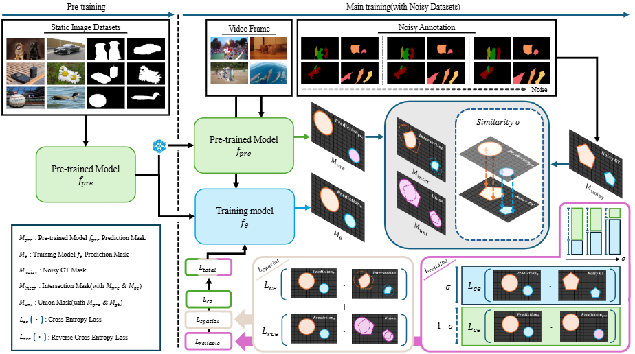

# Spatial Mask-based Adaptive Robust Training for Video Object Segmentation with Noisy Labels

## Introduction



Recent advances in video object segmentation (VOS) highlight its potential across various applications. Semi-supervised VOS aims to segment target objects in video frames based on annotations from the initial frame. Collecting a large-scale video segmentation dataset is challenging, which could induce noisy labels. However, it has been overlooked and most of the research efforts have been devoted to training VOS models by assuming the training dataset is clean. In this study, we first explore the effect of VOS models under noisy labels in the training dataset. To investigate the effect of noisy labels, we simulate the noisy annotations on DAVIS 2017 and YouTubeVOS datasets. Experiments show that the traditional training strategy is vulnerable to noisy annotations. To address this issue, we propose a novel noise-robust training method, named SMART (Spatial Mask-based Adaptive Robust Training), which is designed to train models effectively in the presence of noisy annotations. The proposed method employs two key strategies. Firstly, the model focuses on the common spatial areas from clean knowledge-based predictions and annotations. Secondly, the model is trained with adaptive balancing losses based on their reliability. Comparative experiments have demonstrated the effectiveness of our approach by outperforming other noise handling methods over various noise degrees.

### Requirements

* Python 3.9+
* PyTorch 1.11+ (See [PyTorch](https://pytorch.org/) for installation instructions)
* `torchvision` corresponding to the PyTorch version
* Others: `pip install -r requirements.txt`

### Preparation

```bash
conda create -n smart python=3.8
conda activate smart
conda install pytorch torchvision torchaudio pytorch-cuda=12.1 -c pytorch -c nvidia
git clone https://github.com/cekkec/SMART.git
cd SMART
pip install -r requirements.txt
```

### Dataset

```bash
SMART
├── DAVIS
│   └── 2017
│       ├── test-dev
│       │   ├── Annotations
│       │   └── ...
│       └── trainval
│           ├── Annotations
│           └── ...
├── YouTube
│   ├── all_frames
│   │   └── valid_all_frames
│   ├── train
│   ├── train_480p
│   └── valid
├── YouTube2018
│   ├── all_frames
│   │   └── valid_all_frames
│   └── valid
└── TAO_VOS
    ├── train
    │   ├── Annotations
    │   └── ...
    ├── valid
    └── Imagesets
```

### Noise Simulation
Noise Simulating with Mophological Operation.

* DAVIS 2017
```bash
python eval.py --dataset D17 --output [where to save the output] --d17_path ../DAVIS/2017
```

* YouTubeVOS
```bash
python eval.py --dataset YTV --output [where to save the output] --dataset YTV --YTV_path ../YouTube
```


### Training
To train the model with DAVIS 2017 and YouTubeVOS datasets as in traditional VOS, set `--data_pick all`.  
For training with the TAO dataset, set `--data_pick tao`.

```bash
cd SMART
sh SMART.sh
```

### Inference
* DAVIS 2017:
```bash
python eval.py --model [path to model file] --output [where to save the output] --dataset D17 --d17_path ../DAVIS/2017 --split val
```

* YouTubeVOS 2018:
```bash
python eval.py --model [path to model file] --output [where to save the output] --dataset Y18 --y18_path ../YouTube2018 --split val
```

* YouTubeVOS 2019:
```bash
python eval.py --model [path to model file] --output [where to save the output] --dataset Y19 --y19_path ../YouTube --split val 
```

* TAO-VOS:
```bash
python eval.py --model [path to model file] --output [where to save the output] --dataset TAO --tao_path ../TAO_VOS --split val
```

### Citation
Related projects that this paper is developed upon:
```bibtex
@inproceedings{cheng2022xmem,
  title={{XMem}: Long-Term Video Object Segmentation with an Atkinson-Shiffrin Memory Model},
  author={Cheng, Ho Kei and Alexander G. Schwing},
  booktitle={ECCV},
  year={2022}
}

@inproceedings{xu2018youtubeVOS,
  title={Youtube-vos: A large-scale video object segmentation benchmark},
  author={Xu, Ning and Yang, Linjie and Fan, Yuchen and Yue, Dingcheng and Liang, Yuchen and Yang, Jianchao and Huang, Thomas},
  booktitle = {ECCV},
  year={2018}
}

@inproceedings{perazzi2016benchmark,
  title={A benchmark dataset and evaluation methodology for video object segmentation},
  author={Perazzi, Federico and Pont-Tuset, Jordi and McWilliams, Brian and Van Gool, Luc and Gross, Markus and Sorkine-Hornung, Alexander},
  booktitle={CVPR},
  year={2016}
}
```
